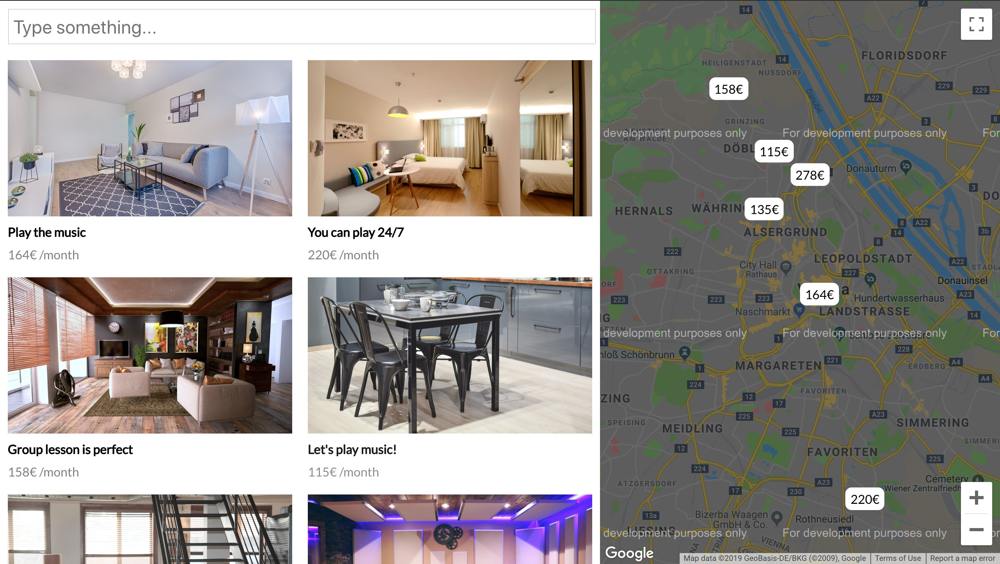

# Geolocation Platform - React/Redux + Express/Node/MongoDB

This is a React application which helps the user to search a place with grid and map.

---
<table>
  <tr>
    <td></td>
  <tr>
</table>

### Prerequisites

What things you need to install the software and how to install them

```
npm create-react-app `project_name`
cd `project_name`
```

### Directory Structure (version 1.2)

```
react-geolocation
├── client/
    │   ├── package.json
    ├── node_modules/ *not included
    ├── public/
    └── src
    │   ├── components/
    │   ├── containers/
    │   ├── helpers/
    │   ├── service/
    │   ├── styles/
    │   ├── App.js
    |   ├── index.js
    |   └── ...
├── server/
    ├── auth/
    │   ├── adminAuth.js
    ├── config/
    │   ├── host.json
    │   ├── index.js
    │   ├── config.js
    │   ├── tokens.js   
    ├── models/
    │   ├── user.js
    ├── node_modules/ *not included
    ├── routes/
    │   ├── user.js
    ├── package-lock.json
    ├── package.json
    └── server.js
├── README.md
```

## Built With

* [Tutorial "Local Library"](https://github.com/mdn/express-locallibrary-tutorial)

* [Twilio Programmable Chat with KendoReact Conversational UI and React] (https://github.com/philnash/twilio-chat-kendo-react)